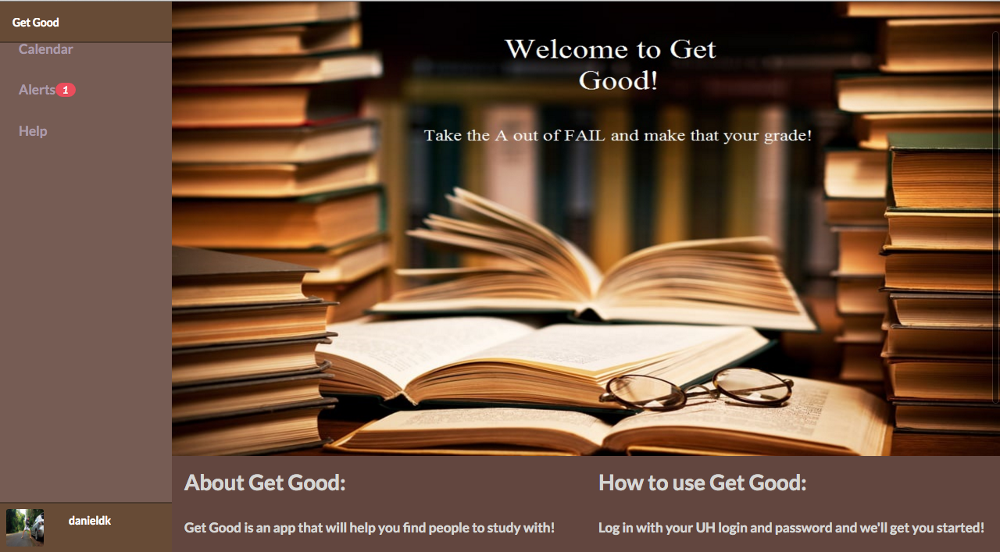
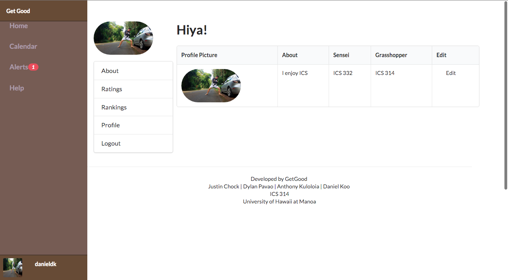
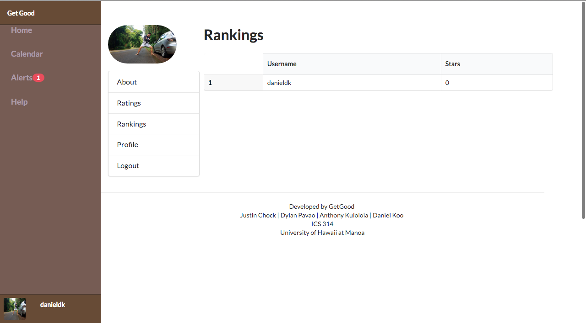

It was always a goal and dream for me to create an application that would be useful for everyday life.  Always having ideas and project goals, it was a fascination for me to create an application but I just didn’t know where to start or how to even begin such a task. Fortunately there was a class offered at University of Hawaii at Manoa, which taught me the basic foundations and concepts to accomplish such a feat.

This was my first time working in a group to produce a web app, and through this experience I've learned how to use github, meteor, and other basic concepts that I've acquired through out this semester in 314.  We were then instructed to create mock-ups for a project that we had in mind, and at this time I wasn’t proficient enough to create what I had in mind.  Although forming a team and sharing ideas and experiences really helped me grow as a software developer.  Through issuing problems and tasks that were needed to make our project complete, really showed me how creating an application is a step-by-step process.

Our team consisted of 4 members, including myself; we created mockup pages for our web application. After deciding on what each member can bring to the table we assigned tasks and began handling issues. We had over a month to complete our web app and consisted of 3 milestones. I was left to create a profile page on which the user can create a profile that consists of their info, classes they are taking (grasshopper), and classes they have took (sensei).

I was also left to create the ranking page on which users can see the ranking of which users have the best ratings and how many sessions they have been contributing to.

This project was very time consuming and quite frustrating to get it working right, but through trial and error I was able to better my skills in CSS and I was able to work with and befriend such talented peers. I truly believe that through this project I was able to learn how much work and effort goes into when creating an application and will be of great use for my future projects!

Our project can be seen here:  <a href="https://github.com/get-good/get-good.github.io">https://github.com/get-good/get-good.github.io</a>

