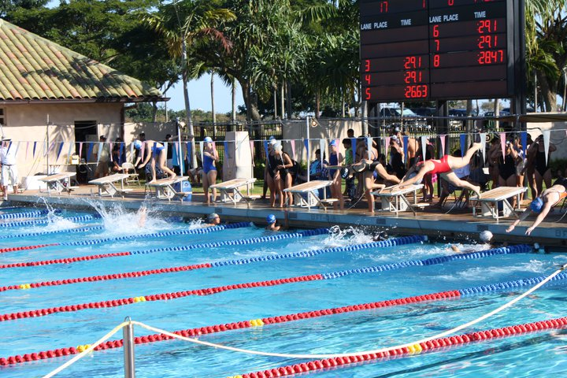

Through my years at Kalani High school, I was going to experience some that would change my life. I never thought that I would be able to experience an environment where I’d be consistently training with a group of elite athletes.  Behold I was finally on the Kalani swim team, with every day of training I was one step closer to becoming a swimmer.  Through every swimming meet my time would steadily increase, and my form would be better.  By the end of my experience I was only able to achieve a certain height and I’d only get better if I kept swimming.  

Through this experience I could apply now apply it to anything I want to pursue. Being that my new ambition is programming and coding, I have to apply the same fundamentals for when I grew to be a swimmer. I must spend countless hours practicing and learning all the fundamentals and then grow on those fundamentals to become a proficient programmer. 
